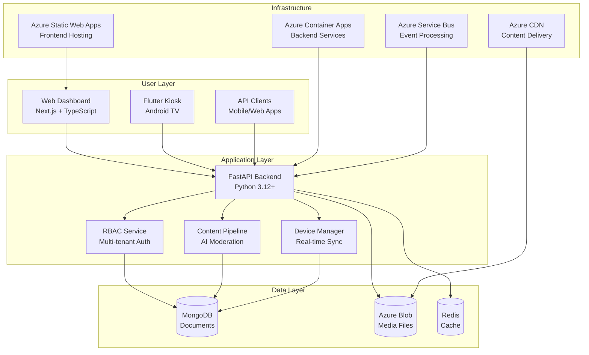
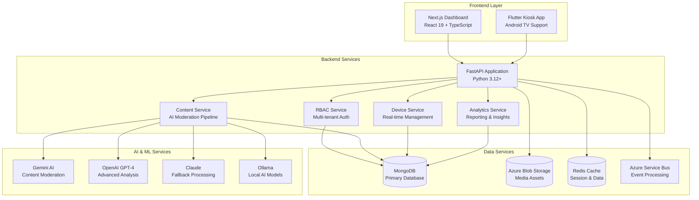
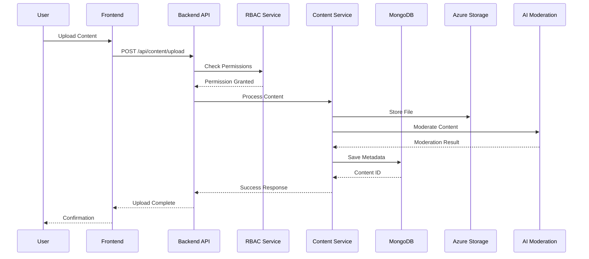

<!-- Copyright (c) 2025 Adara Screen by Hebron
Owner: Sujesh M S
All Rights Reserved

This software is proprietary to Adara Screen by Hebron.
Unauthorized use, reproduction, or distribution is strictly prohibited. -->

# Adara Screen Digital Signage Platform

A comprehensive, enterprise-grade digital signage platform with advanced Role-Based Access Control (RBAC), multi-tenant architecture, and AI-powered content moderation.

## 🌟 Key Features

### 🔐 **Advanced RBAC & Multi-Tenant Security** ✅ **FULLY IMPLEMENTED**
- **Three-Tier User System**: Super Users, Company Users, and Device Users
- **Granular Permissions**: Resource-based permissions (content_create, content_approve, device_manage, etc.)
- **Company Isolation**: Complete data separation between companies with secure content sharing
- **Device Authentication**: API key-based authentication for secure device access
- **Role Hierarchy**: Admin, Reviewer, Editor, and Viewer roles with appropriate permissions

### 🏢 **Enterprise Multi-Tenancy** ✅ **FULLY IMPLEMENTED**
- **Company Management**: HOST and ADVERTISER company types with customizable settings
- **Content Sharing**: Controlled content sharing between companies with approval workflows
- **Company Limits**: Configurable limits for users, devices, and content per company
- **Branding & Customization**: Company-specific settings and configurations

### 📊 **Advanced Content Management** ✅ **FULLY IMPLEMENTED**
- **AI-Powered Moderation**: Azure AI Content Safety integration with content scoring
- **Multi-Provider AI**: Gemini, OpenAI GPT-4, Claude, Ollama with automatic failover
- **Approval Workflows**: Multi-stage content approval with reviewer assignments
- **Content Versioning**: Track content changes and approval history
- **Multi-Format Support**: Images, videos, HTML5, and text content
- **Visibility Controls**: Private, shared, and public content visibility levels

### 🖥️ **Smart Device Management** ✅ **FULLY IMPLEMENTED**
- **Secure Device Registration**: Automatic device registration with unique API keys
- **Company-Based Access**: Devices access only authorized company content
- **Real-time Monitoring**: Device status tracking and health monitoring
- **Content Synchronization**: Intelligent content delivery to appropriate devices
- **Offline Capabilities**: Cached content for offline operation
- **Digital Twin**: Virtual device representation for remote management

### 👥 **Comprehensive User Management** ✅ **FULLY IMPLEMENTED**
- **Super User Dashboard**: Platform-wide administration and monitoring
- **Company User Roles**: Role-based access within companies
- **Permission-Based UI**: Dynamic interface based on user permissions
- **User Activity Tracking**: Audit trails and activity monitoring

### 🤖 **AI & Analytics** ✅ **FULLY IMPLEMENTED**
- **Multi-Provider AI Moderation**: Automatic content safety checking
- **Real-time Analytics**: Performance monitoring and usage statistics
- **Predictive Analytics**: AI-powered insights and recommendations
- **Event-Driven Processing**: Azure Service Bus integration
- **WebSocket Communication**: Real-time device communication

### 🔒 **Enhanced Security Features** ✅ **NEW IN v2.0.0**
- **Field-level PII Encryption**: Sensitive data encryption at the field level
- **Azure Key Vault Integration**: Secure key management and secrets storage
- **Security Headers**: Comprehensive security headers and rate limiting
- **Refresh Token Authentication**: Enhanced JWT authentication with refresh tokens
- **Audit Logging**: Comprehensive security and activity logging
- **Event-Driven Architecture**: Asynchronous processing with Azure Service Bus

### 📱 **Complete Flutter Kiosk Application** ✅ **FULLY IMPLEMENTED**
- **5-Screen Architecture**: Registration, Authentication, Content Display, Settings, and Admin screens
- **QR Code Registration**: Seamless device registration with QR code scanning
- **Offline Content Caching**: Local content storage for offline operation
- **Real-time Updates**: WebSocket-based real-time content synchronization
- **Interactive Content**: Support for interactive digital signage content
- **Device Health Monitoring**: Automatic health reporting and status updates

## 🔧 Technology Stack

### Backend Architecture ✅ **FULLY IMPLEMENTED v2.0.0**
- **FastAPI 0.115.0**: High-performance Python web framework with automatic OpenAPI documentation
- **Python 3.12+**: Latest Python with enhanced performance and security features
- **MongoDB 7.0**: Document database with advanced indexing and aggregation
- **Azure AI Content Safety**: AI-powered content moderation and scoring
- **Azure Service Bus**: Reliable message queue for event processing
- **Azure Blob Storage**: Scalable file storage with CDN integration
- **Azure Key Vault**: Secure secrets management and encryption keys
- **Redis 6.4+**: High-performance caching and session storage
- **UV**: Fast Python package installer and resolver for efficient dependency management
- **WebSocket Support**: Real-time bidirectional communication
- **JWT Authentication**: Secure token-based authentication with refresh tokens

### Frontend Architecture ✅ **FULLY IMPLEMENTED**
- **Next.js 15.5.2**: React framework with Turbopack for fast development
- **React 19.1.0**: Latest React with concurrent features and performance improvements
- **TypeScript 5.0+**: Type-safe development with enhanced developer experience
- **Tailwind CSS 4.0**: Utility-first CSS framework for rapid UI development
- **React Hook Form 7.62+**: Performant forms with easy validation
- **Zustand**: Lightweight state management for complex application state
- **Framer Motion 12.23+**: Smooth animations and transitions
- **React Chart.js 2**: Data visualization and analytics charts
- **Recharts 2.15+**: Advanced charting library for analytics dashboards
- **Lucide React 0.542+**: Beautiful and consistent icon library
- **Radix UI**: Accessible component primitives for professional UI

### Mobile/Display Architecture ✅ **FULLY IMPLEMENTED**
- **Flutter 3.24+**: Cross-platform framework for device applications
- **Dart 3.9.0+**: Modern programming language with null safety
- **Provider 6.1+**: State management for device authentication and content
- **Riverpod 2.4+**: Advanced state management with dependency injection
- **Go Router 13.0+**: Declarative routing for Flutter applications
- **Get It 7.6+**: Service locator for dependency injection
- **HTTP Client**: Secure API communication with automatic retry
- **Video Player 2.8+**: Advanced video playback capabilities
- **WebView Flutter 4.4+**: Embedded web content display
- **QR Code Scanning**: Mobile Scanner for device registration
- **Secure Storage 9.2+**: Encrypted local data storage
- **Connectivity Plus 6.0+**: Network connectivity monitoring
- **Permission Handler 11.3+**: Runtime permission management

### Infrastructure & DevOps ✅ **FULLY IMPLEMENTED**
- **Docker**: Containerized deployment for consistency
- **Azure Bicep**: Infrastructure as Code for Azure resources
- **GitHub Actions**: CI/CD pipeline for automated deployment
- **Azurite**: Local Azure Storage emulator for development

## 🚀 Quick Start

> 🔑 **Need Keys & Secrets?** Check [KEYS_REFERENCE.md](KEYS_REFERENCE.md) for a complete checklist
>
> 🤖 **Automated Setup**: Run `.\setup-environment.ps1` (Windows) for one-click setup

### System Architecture Overview



### Prerequisites

| Component | Version | Required For | Installation |
|-----------|---------|--------------|--------------|
| **Python** | 3.12+ | Backend development | `winget install Python.Python.3.12` |
| **UV** | Latest | Python package management | `curl -LsSf https://astral.sh/uv/install.sh \| sh` |
| **Node.js** | 18+ | Frontend development | `winget install OpenJS.NodeJS` |
| **Docker** | Latest | Local services | `winget install Docker.DockerDesktop` |
| **Git** | Latest | Version control | `winget install Git.Git` |

**One-Click Setup (Windows):**
```powershell
# Run the automated setup script
.\setup-environment.ps1
```

**Manual Installation:**
```bash
# Install UV (Python package manager)
curl -LsSf https://astral.sh/uv/install.sh | sh

# Verify installations
python --version  # Should be 3.12+
node --version    # Should be 18+
docker --version  # Should be latest
```

### 2. Clone and Setup

```bash
# Clone the repository
git clone <repository-url>
cd Open_kiosk

# Start backend services with Docker
cd backend/content_service
docker-compose up -d

# Install and start frontend
cd ../../frontend
npm install
npm run dev

# Access URLs:
# Frontend: http://localhost:3000
# Backend API: http://localhost:8000
# API Documentation: http://localhost:8000/docs
```

### 3. Initialize with Sample Data

```bash
# Navigate to backend service
cd backend/content_service

# Run the comprehensive seeding script using UV
uv run python seed_data.py
```

**What gets created:**
- ✅ **4 Sample Companies** with unique organization codes
- ✅ **16 Users** with proper role assignments across companies
- ✅ **Secure Registration Keys** for device registration
- ✅ **Complete RBAC Permissions** setup
- ✅ **Sample Content** and metadata for testing

### 4. Login with Sample Accounts

#### Platform Administration
**Super User (Platform Administrator):**
- Email: `admin@adara.com`
- Password: `adminpass`
- Access: Full platform administration and monitoring

#### Company-Specific Users

**TechCorp Solutions (HOST Company):**
- Admin: `admin@techcorpsolutions.com` / `adminpass`
- Reviewer: `reviewer@techcorpsolutions.com` / `reviewerpass`
- Editor: `editor@techcorpsolutions.com` / `editorpass`
- Viewer: `viewer@techcorpsolutions.com` / `viewerpass`

**Creative Ads Inc (ADVERTISER Company):**
- Director: `director@creativeadsinc.com` / `advertiserpass`
- Approver: `approver@creativeadsinc.com` / `advertiserpass`
- Creator: `creator@creativeadsinc.com` / `advertiserpass`
- Analytics: `analytics@creativeadsinc.com` / `advertiserpass`

### 5. Test Device Registration

Use the Flutter app or test with API calls:

```bash
# Test device registration (replace with actual company info)
curl -X POST "http://localhost:8000/api/auth/device/register" \
  -H "Content-Type: application/json" \
  -d '{
    "device_name": "Lobby Display",
    "device_type": "display",
    "location": "Main Lobby",
    "company_code": "ORG-ABC123"
  }'
```

## 🏗️ System Architecture

### Core Components Architecture



### Data Flow Architecture



## 📊 Feature Overview

### 🔐 Advanced Security & RBAC

| Feature | Description | Implementation |
|---------|-------------|----------------|
| **Multi-Tenant RBAC** | Company-based access control with granular permissions | ✅ **FULLY IMPLEMENTED** |
| **JWT Authentication** | Secure token-based auth with refresh capabilities | ✅ **FULLY IMPLEMENTED** |
| **Device API Keys** | Secure device authentication and registration | ✅ **FULLY IMPLEMENTED** |
| **Audit Logging** | Comprehensive activity tracking and compliance | ✅ **FULLY IMPLEMENTED** |
| **Session Management** | Advanced session tracking and security monitoring | ✅ **FULLY IMPLEMENTED** |

### 🤖 AI-Powered Content Moderation

| AI Provider | Purpose | Status |
|-------------|---------|--------|
| **Google Gemini** | Primary content analysis and moderation | ✅ **ACTIVE** |
| **OpenAI GPT-4** | Advanced content understanding | ✅ **FALLBACK** |
| **Anthropic Claude** | High-accuracy content classification | ✅ **FALLBACK** |
| **Ollama** | Local AI processing (cost-effective) | ✅ **LOCAL** |

### 📱 Multi-Platform Support

| Platform | Technology | Features |
|----------|------------|----------|
| **Web Dashboard** | Next.js 15 + React 19 | Full admin interface, real-time updates |
| **Flutter Kiosk** | Flutter 3.24+ | 5-screen architecture, offline support |
| **Mobile Apps** | React Native (planned) | Remote management, content preview |
| **API Integration** | REST + GraphQL | Third-party system integration |

### ☁️ Cloud Infrastructure

| Service | Purpose | Configuration |
|---------|---------|---------------|
| **Azure Container Apps** | Backend microservices | Auto-scaling, serverless |
| **Azure Static Web Apps** | Frontend hosting | Global CDN, CI/CD integration |
| **Azure Cosmos DB** | Primary database | MongoDB API, global distribution |
| **Azure Blob Storage** | Media assets | CDN integration, lifecycle management |
| **Azure Service Bus** | Event processing | Reliable messaging, dead-letter queues |

**Quick Install Commands:**
```bash
# Install UV (Python package manager)
curl -LsSf https://astral.sh/uv/install.sh | sh

# Or via pip as fallback
pip install uv
```

Ensure you have the following installed:

- **Python 3.12+** with UV package manager
- **Node.js 18+** with npm
- **Docker & Docker Compose**
- **Git**
- **UV**: Fast Python package installer

### Installing UV

```bash
# Windows (PowerShell)
curl -LsSf https://astral.sh/uv/install.sh | sh

# Or install via pip as fallback
pip install uv
```

### 2. Clone and Setup

```bash
# Clone the repository
git clone <repository-url>
cd Open_kiosk

# Start backend services with Docker
cd backend/content_service
docker-compose up -d

# Install and start frontend
cd ../../frontend
npm install
npm run dev

# Frontend will be available at http://localhost:3000
# Backend API at http://localhost:8000
# API Documentation at http://localhost:8000/docs
```

### 3. Initialize with Sample Data

```bash
# Navigate to backend service
cd backend/content_service

# Run the comprehensive seeding script using UV
uv run python seed_data.py
```

### 4. Login with Sample Accounts

**Super User (Platform Administrator):**
- Email: `admin@adara.com`
- Password: `adminpass`
- Access: Full platform administration

**Company Admin (TechCorp Solutions):**
- Email: `admin@techcorpsolutions.com`
- Password: `adminpass`
- Access: Company management and device oversight

**Content Reviewer (Creative Ads Inc):**
- Email: `reviewer@creativeadsinc.com`
- Password: `reviewerpass`
- Access: Content approval and moderation

**Content Editor (Digital Displays LLC):**
- Email: `editor@digitaldisplays.com`
- Password: `editorpass`
- Access: Content creation and editing

### 5. Test Device Registration

Use the Flutter app or test with API calls:

```bash
# Test device registration (replace with actual company info)
curl -X POST "http://localhost:8000/api/auth/device/register" \
  -H "Content-Type: application/json" \
  -d '{
    "device_name": "Lobby Display", 
    "device_type": "display", 
    "location": "Main Lobby"
  }'
```

## 📱 Application Components

### Web Management Interface (`/frontend`)
- **Super User Dashboard**: Platform overview, company management, system monitoring
- **Company Dashboard**: Company-specific content and device management
- **Content Management**: Upload, review, and approve content with AI moderation
- **Device Management**: Monitor and configure display devices
- **User Management**: Manage company users and permissions
- **Analytics & Reporting**: Usage statistics and performance metrics

### Flutter Display Application (`/flutter`)
- **Device Registration**: Automatic setup and company association
- **Content Playback**: Secure content display with company isolation
- **Offline Mode**: Cached content for network interruptions
- **Status Reporting**: Real-time device health and content status
- **Remote Management**: Over-the-air updates and configuration

### Backend API (`/backend/content_service`)
- **RBAC Service**: Advanced permission and role management
- **Content Pipeline**: Upload, moderation, and approval workflows
- **Device Authentication**: Secure API key-based device access
- **Company Isolation**: Multi-tenant data separation
- **AI Integration**: Content safety and automated moderation
- **Audit Logging**: Comprehensive activity and security logging

## Data Seeding & Development Setup

### Automated Data Seeding

The platform includes a comprehensive seeding system for development and testing:

```bash
# After starting the backend services
cd backend/content_service

# Run the seeding script using UV
uv run python seed_data.py
```

**What gets created:**
- ✅ 4 sample companies with unique organization codes
- ✅ 9 users with proper role assignments
- ✅ Secure registration keys for device registration
- ✅ Complete RBAC permissions setup
- ✅ Sample content and metadata

### Development Workflow

1. **Start Services**: `docker-compose up -d` (from backend/content_service)
2. **Seed Data**: `uv run python seed_data.py`
3. **Start Frontend**: `npm run dev` (from frontend directory)
4. **Access Application**: 
   - Frontend: http://localhost:3000
   - Backend API: http://localhost:8000
   - API Docs: http://localhost:8000/docs

### Testing the Platform

**Login Credentials:**
- **Admin**: admin@adara.com / adminpass
- **Host**: host@techcorpsolutions.com / hostpass
- **Advertiser**: director@creativeadsinc.com / advertiserpass

**Device Registration:**
- Use organization codes (ORG-XXXXXXX) and registration keys from seeding output
- Test multi-tenant isolation and role-based permissions
- Verify content upload and AI moderation workflows

## Manual Setup (Alternative)

If you prefer to run services individually without Docker:

### Backend Setup

```bash
# Navigate to backend service
cd backend/content_service

# Create virtual environment using UV
uv venv

# Activate virtual environment
# Windows:
.\.venv\Scripts\Activate.ps1
# Linux/Mac:
source .venv/bin/activate

# Install dependencies using UV
uv sync

# Start the development server
uv run uvicorn app.main:app --reload --port 8000
```

### Database Setup

For local development without Docker, you'll need:

1. **MongoDB**: Install MongoDB Community Server or use MongoDB Atlas
2. **Azurite**: Install Azure Storage Emulator

```bash
# Install Azurite globally
npm install -g azurite

# Start Azurite
azurite
```

### Frontend Setup

```bash
# Navigate to frontend directory
cd frontend

# Install dependencies
npm install

# Start development server
npm run dev
```

## 🔑 Required Keys & Environment Configuration

### GitHub Repository Secrets (for CI/CD)

These secrets must be configured in your GitHub repository settings for automated deployments:

#### Azure Authentication
- `AZURE_CREDENTIALS` - Service principal credentials in JSON format:
  ```json
  {
    "clientId": "your-client-id",
    "clientSecret": "your-client-secret", 
    "subscriptionId": "your-subscription-id",
    "tenantId": "your-tenant-id"
  }
  ```

#### Azure Infrastructure Secrets
- `RESOURCE_GROUP_NAME` - Azure resource group name
- `AZURE_LOCATION` - Azure region (e.g., "eastus", "westus2")
- `PROJECT_NAME` - Project name used for resource naming

#### Backend Deployment
- `CONTAINER_REGISTRY_NAME` - Azure Container Registry name (without .azurecr.io)
- `BACKEND_CONTAINER_APP_NAME` - Azure Container App name for backend

#### Frontend Deployment  
- `AZURE_STATIC_WEB_APPS_API_TOKEN` - Azure Static Web Apps deployment token
- `NEXT_PUBLIC_API_URL` - Backend API URL for frontend
- `FRONTEND_APP_URL` - Frontend URL for health checks (optional)

#### Terraform Backend
- `TERRAFORM_STORAGE_ACCOUNT` - Storage account name for Terraform state
- `TERRAFORM_CONTAINER_NAME` - Blob container name for state (usually "tfstate")
- `TERRAFORM_STATE_KEY` - State file name (e.g., "terraform.tfstate")
- `TERRAFORM_RESOURCE_GROUP` - Resource group containing the storage account

### Local Development Environment Files

#### Backend Environment (.env)

```bash
# Database Configuration
MONGO_URI=mongodb://localhost:27017/openkiosk
DATABASE_NAME=openkiosk

# Security Keys (CHANGE THESE IN PRODUCTION!)
SECRET_KEY=your-super-secure-secret-key-change-me-for-production
JWT_SECRET_KEY=your-jwt-secret-key-change-me-for-production
ALGORITHM=HS256
ACCESS_TOKEN_EXPIRE_MINUTES=30

# Environment
ENVIRONMENT=development

# Azure Storage (Development)
AZURE_STORAGE_CONNECTION_STRING=UseDevelopmentStorage=true
AZURE_STORAGE_CONTAINER=content

# Azure Storage (Production - when using real Azure)
# AZURE_STORAGE_CONNECTION_STRING=DefaultEndpointsProtocol=https;AccountName=<account>;AccountKey=<key>;EndpointSuffix=core.windows.net
# AZURE_STORAGE_CONTAINER=content

# Azure Service Bus (optional for production features)
# SERVICE_BUS_CONNECTION_STRING=Endpoint=sb://<namespace>.servicebus.windows.net/;SharedAccessKeyName=<keyname>;SharedAccessKey=<key>

# Azure AI Content Safety (optional for AI moderation)
# CONTENT_SAFETY_ENDPOINT=https://<resource>.cognitiveservices.azure.com/
# CONTENT_SAFETY_KEY=<your-content-safety-key>

# Email Configuration (optional)
# SMTP_SERVER=smtp.gmail.com
# SMTP_PORT=587
# SMTP_USERNAME=<your-email>
# SMTP_PASSWORD=<your-app-password>

# Redis (optional for caching)
# REDIS_URL=redis://localhost:6379

# Logging
# LOG_LEVEL=INFO
```

#### Frontend Environment (.env.local)

```bash
# API Configuration
NEXT_PUBLIC_API_URL=http://localhost:8000

# Environment
NODE_ENV=development

# Optional: Analytics or other services
# NEXT_PUBLIC_GA_ID=your-google-analytics-id
# NEXT_PUBLIC_SENTRY_DSN=your-sentry-dsn
```

### Azure Service Principal Setup

To create the required Azure service principal for GitHub Actions:

```bash
# Create service principal with Contributor role
az ad sp create-for-rbac --name "github-actions-sp" \
  --role contributor \
  --scopes /subscriptions/{subscription-id} \
  --sdk-auth

# Copy the entire JSON output to AZURE_CREDENTIALS secret
```

### Azure Static Web Apps Token

To get the deployment token for Static Web Apps:

1. Go to Azure Portal → Static Web Apps → your app
2. Navigate to "Manage deployment token" 
3. Copy the token to `AZURE_STATIC_WEB_APPS_API_TOKEN` secret

### Container Registry Access

Ensure your service principal has ACR access:

```bash
# Grant AcrPush permission to service principal
az role assignment create \
  --assignee <service-principal-client-id> \
  --role AcrPush \
  --scope /subscriptions/{subscription-id}/resourceGroups/{rg-name}/providers/Microsoft.ContainerRegistry/registries/{acr-name}
```

### Security Best Practices

1. **Never commit secrets to version control**
2. **Use different secrets for development/staging/production**
3. **Rotate secrets regularly, especially in production**
4. **Use least privilege access for service principals**
5. **Monitor Azure Activity Logs for unauthorized access**

### Quick Setup Commands

```bash
# 1. Copy environment template
cp backend/content_service/.env.template backend/content_service/.env

# 2. Edit with your values
nano backend/content_service/.env

# 3. Create frontend environment
echo "NEXT_PUBLIC_API_URL=http://localhost:8000" > frontend/.env.local

# 4. Start services
cd backend/content_service && docker-compose up -d
cd ../../frontend && npm run dev
```

> 📚 **For detailed setup instructions**: See [.github/SECRETS_SETUP.md](.github/SECRETS_SETUP.md)

## Default Test Data

The application includes a comprehensive data seeding system that creates production-ready test data:

### Data Seeding

Run the seeding script to populate the database with test data:

```bash
# Navigate to backend service
cd backend/content_service

# Run the seeding script
python seed_data.py
```

This creates:
- **4 Sample Companies** with unique organization codes (ORG-XXXXXXX format)
- **9 Users** with proper role assignments across companies
- **Secure Registration Keys** for device registration (16-character keys)
- **Complete RBAC Setup** with permissions and role assignments

### Default Companies
- **TechCorp Solutions** (HOST) - ORG-XXXXXXX
- **Creative Ads Inc** (ADVERTISER) - ORG-XXXXXXX
- **Digital Displays LLC** (HOST) - ORG-XXXXXXX
- **AdVantage Media** (ADVERTISER) - ORG-XXXXXXX

### Default Users
- `admin@adara.com` / `adminpass` (System Administrator)
- `host@techcorpsolutions.com` / `hostpass` (Host Manager)
- `operator@techcorpsolutions.com` / `hostpass` (Screen Operator)
- `director@creativeadsinc.com` / `advertiserpass` (Advertiser Director)
- `creator@creativeadsinc.com` / `advertiserpass` (Content Creator)

### Registration Keys
Each company gets a unique 16-character registration key for device registration:
- TechCorp Solutions: [Generated key]
- Creative Ads Inc: [Generated key]
- Digital Displays LLC: [Generated key]
- AdVantage Media: [Generated key]

### Organization Codes
Each company has a unique organization code used for device registration:
- TechCorp Solutions: ORG-XXXXXXX
- Creative Ads Inc: ORG-XXXXXXX
- Digital Displays LLC: ORG-XXXXXXX
- AdVantage Media: ORG-XXXXXXX

## Running Tests

### Backend Tests

```bash
# Navigate to backend service
cd backend/content_service

# Activate virtual environment (if not already active)
.\.venv\Scripts\Activate.ps1

# Run tests using UV
uv run pytest tests -q
```

### Frontend Tests

```bash
# Navigate to frontend directory
cd frontend

# Run tests (if configured)
npm test
```

## Building for Production

### Backend

```bash
# Build Docker image
docker build -t content-service .

# Or build with uv (if using uv)
uv build
```

### Frontend

```bash
# Build for production
npm run build

# Start production server
npm start
```

## API Documentation

Once the backend is running, you can access:

- **API Documentation**: `http://localhost:8000/docs` (Swagger UI)
- **Alternative Docs**: `http://localhost:8000/redoc`

## Project Structure

```
├── backend/
│   └── content_service/          # FastAPI microservice
│       ├── app/                  # Application code
│       │   ├── api/              # API routes and endpoints
│       │   ├── auth.py           # Authentication & authorization
│       │   ├── models.py         # Pydantic data models
│       │   ├── repo.py           # Data repository layer
│       │   └── routes/           # Additional route handlers
│       ├── seed_data.py          # Database seeding script
│       ├── tests/                # Unit and integration tests
│       ├── data/                 # Local data storage
│       ├── pyproject.toml        # UV configuration and dependencies
│       ├── uv.lock               # UV dependency lock file
│       ├── Dockerfile            # Docker configuration
│       └── docker-compose.yml    # Multi-service orchestration
├── frontend/                     # Next.js application
│   ├── src/
│   │   ├── app/                  # Next.js app router pages
│   │   ├── components/           # React components
│   │   ├── hooks/                # Custom React hooks
│   │   └── lib/                  # Utility libraries
│   ├── package.json              # Node.js dependencies
│   └── next.config.ts            # Next.js configuration
├── flutter/                      # Flutter mobile app
│   └── adarah_digital_signage/   # Digital signage kiosk app
├── infra/                        # Infrastructure as Code
│   └── main.bicep               # Azure Bicep templates
├── docs/                        # Documentation
│   ├── api.md                   # API documentation
│   ├── ARCHITECTURE.md          # System architecture
│   └── *.md                     # Additional docs
└── README.md                    # This file
```

## 📚 Documentation

### **Quick References**
- **[Quick Start Guide](docs/QUICKSTART.md)** - 30-minute setup for development and production
- **[Deployment Guide](docs/DEPLOYMENT_GUIDE.md)** - Complete Azure deployment instructions
- **[API Documentation](docs/api.md)** - REST API endpoints and integration guides

### **Architecture & Design**
- **[System Architecture](docs/ARCHITECTURE.md)** - Technical design and component overview
- **[RBAC System](docs/ENHANCED_RBAC_SYSTEM.md)** - Authentication and permission system
- **[Database Design](docs/DATA_MODEL.md)** - MongoDB schema and relationships

### **Application Components**
- **[Flutter App Specification](docs/FLUTTER_APP_SPEC.md)** - Mobile/kiosk application details
- **[AI Content Moderation](docs/AI_CONTENT_MODERATION_FRAMEWORK.md)** - AI moderation system
- **[UI Specifications](docs/UI_SPEC.md)** - Frontend component library and design

### **Development Resources**
- **[Implementation Checklist](docs/IMPLEMENTATION_CHECKLIST_MASTER.md)** - Current development status
- **[Optimization Report](docs/CODEBASE_OPTIMIZATION_REPORT.md)** - Code quality and improvement areas
- **[Security Guidelines](docs/security/)** - Security policies and best practices

> **Note**: Documentation was recently optimized - 21 duplicate and outdated files were removed, consolidating from 33 to 12 essential documents with comprehensive cross-references.

## Development Workflow

1. **Create Feature Branch**: `git checkout -b feature/your-feature-name`
2. **Make Changes**: Implement your feature
3. **Run Tests**: Ensure all tests pass
4. **Commit Changes**: `git commit -m "Add your feature"`
5. **Push Branch**: `git push origin feature/your-feature-name`
6. **Create Pull Request**: Submit for review

## Contributing

Please read our [Contributing Guidelines](docs/CONTRIBUTING.md) before making contributions.

## License

This project is licensed under the MIT License - see the [LICENSE](LICENSE) file for details.

## Support

For support and questions:

- Check the [Documentation](docs/)
- Create an [Issue](https://github.com/your-repo/issues)
- Contact the development team

---

**Note**: This platform is designed to work with popular digital signage systems like Yodeck and Xibo. Integration details are available in the [API Documentation](docs/api.md).
# Ad-rah

 ✓ Created SUPER_USER user: admin@adara.com (Role: None)
  ✓ Created COMPANY_USER user: admin@techcorpsolutions.com (Role: ADMIN)
  ✓ Created COMPANY_USER user: reviewer@techcorpsolutions.com (Role: REVIEWER)        
  ✓ Created COMPANY_USER user: editor@techcorpsolutions.com (Role: EDITOR)
  ✓ Created COMPANY_USER user: viewer@techcorpsolutions.com (Role: VIEWER)
  ✓ Created COMPANY_USER user: admin@digitaldisplaysllc.com (Role: ADMIN)
  ✓ Created COMPANY_USER user: reviewer@digitaldisplaysllc.com (Role: REVIEWER)       
  ✓ Created COMPANY_USER user: editor@digitaldisplaysllc.com (Role: EDITOR)
  ✓ Created COMPANY_USER user: viewer@digitaldisplaysllc.com (Role: VIEWER)
  ✓ Created COMPANY_USER user: director@creativeadsinc.com (Role: ADMIN)
  ✓ Created COMPANY_USER user: approver@creativeadsinc.com (Role: REVIEWER)
  ✓ Created COMPANY_USER user: creator@creativeadsinc.com (Role: EDITOR)
  ✓ Created COMPANY_USER user: analytics@creativeadsinc.com (Role: VIEWER)
  ✓ Created COMPANY_USER user: director@advantagemedia.com (Role: ADMIN)
  ✓ Created COMPANY_USER user: approver@advantagemedia.com (Role: REVIEWER)
  ✓ Created COMPANY_USER user: creator@advantagemedia.com (Role: EDITOR)
  ✓ Created COMPANY_USER user: analytics@advantagemedia.com (Role: VIEWER)
