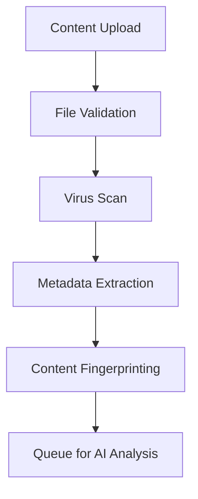
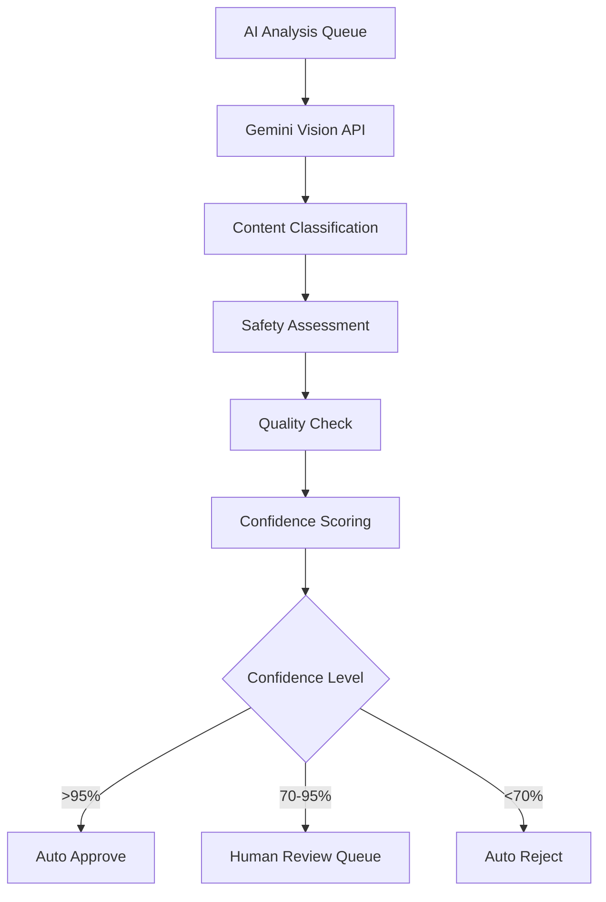
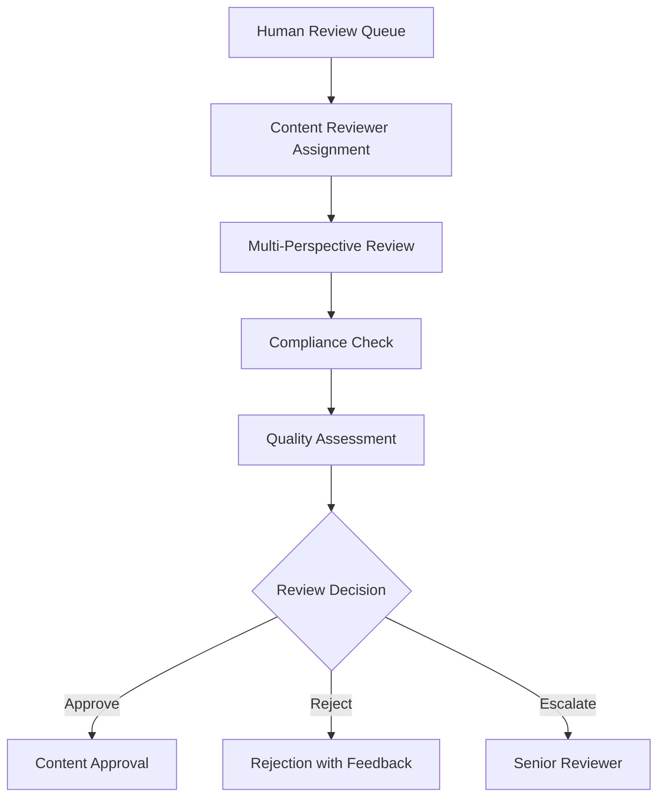
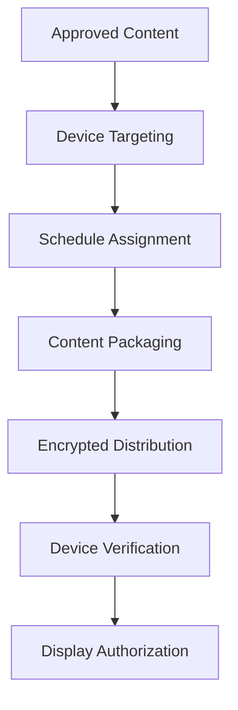

# 🤖 AI Content Moderation & Human-in-Loop Approval Framework

## � **FRAMEWORK UPDATE: AGENTIC AI ARCHITECTURE**

**New Feature Alert**: The AI Content Moderation Framework has been enhanced with a revolutionary **agentic architecture** that provides:

- ⚡ **Multi-Provider Support**: Seamlessly switch between Gemini, OpenAI, Claude, Ollama, and more
- 🔄 **Automatic Failover**: If primary AI fails, automatically uses fallback providers
- 💰 **Cost Optimization**: Switch to cheaper models like Ollama (free local AI) when needed
- 🎯 **Easy Configuration**: Change AI providers with a single command
- 📊 **Performance Monitoring**: Real-time metrics for all AI providers

### Quick Provider Switching Examples:
```bash
# Switch to Google Gemini (recommended)
python ai_manager.py switch gemini

# Switch to free local AI (Ollama)
python ai_manager.py switch ollama

# Switch to OpenAI for high accuracy
python ai_manager.py switch openai

# Check status of all providers
python ai_manager.py status
```

See the complete setup guide: `backend/content_service/README_AI_MODERATION.md`

---

## �📋 REQUIREMENTS & COMPLIANCE SPECIFICATIONS

### **Regulatory Compliance**
- **GDPR Compliance**: Data processing transparency and user consent
- **Content Safety Standards**: Adult content, violence, hate speech detection
- **Accessibility Standards**: WCAG 2.1 AA compliance for visual content
- **Advertising Standards**: Truth in advertising, disclosure requirements
- **Industry Standards**: IAB Tech Lab guidelines for digital advertising

### **Security Requirements**
- **Input Validation**: All uploads validated for malicious content
- **File Type Restrictions**: Whitelist approved formats (jpg, png, gif, mp4, webp)
- **Size Limitations**: Max file size 50MB, max dimensions 4K resolution
- **Virus Scanning**: All uploads scanned before processing
- **Content Encryption**: Files encrypted at rest with AES-256
- **Access Logging**: All moderation actions logged with audit trail

### **AI Moderation Standards**
- **Multi-Modal Analysis**: Text, image, and video content analysis
- **Confidence Thresholds**: >95% auto-approve, 70-95% human review, <70% auto-reject
- **Bias Detection**: Regular bias audits and fairness assessments
- **Model Transparency**: Explainable AI decisions with reasoning
- **Human Oversight**: Mandatory human review for sensitive content

---

## 🔄 CONTENT APPROVAL WORKFLOW

### **Phase 1: Upload & Pre-Processing**


**Security Measures:**
- File signature validation
- Content type verification
- Malware scanning with ClamAV
- Size and dimension limits
- Duplicate detection

### **Phase 2: AI Analysis (Gemini Integration)**


**AI Capabilities:**
- **Visual Content**: Object detection, scene analysis, text extraction
- **Text Content**: Sentiment analysis, hate speech detection, fact-checking
- **Video Content**: Frame-by-frame analysis, audio transcription
- **Brand Safety**: Logo detection, competitor content identification

### **Phase 3: Human Review Process**


**Review Criteria:**
- Content accuracy and truthfulness
- Brand guideline compliance
- Cultural sensitivity assessment
- Legal compliance verification
- Technical quality standards

### **Phase 4: Content Distribution**


**Distribution Security:**
- End-to-end encryption
- Device authentication
- Content integrity verification
- Rollback capabilities
- Analytics tracking

---

## 🔧 TECHNICAL IMPLEMENTATION

### **AI Integration Architecture**
```python
# Gemini AI Integration Service
class GeminiModerationService:
    def __init__(self):
        self.client = genai.GenerativeModel('gemini-1.5-pro')
        self.vision_client = genai.GenerativeModel('gemini-1.5-flash-8b')
    
    async def analyze_content(self, content_data: ContentData) -> ModerationResult:
        # Multi-modal analysis implementation
        pass
    
    async def explain_decision(self, result: ModerationResult) -> str:
        # Generate human-readable explanation
        pass
```

### **Human-in-Loop Integration**
```python
# Review Assignment System
class ReviewAssignmentService:
    async def assign_reviewer(self, content_id: str) -> str:
        # Smart reviewer assignment based on:
        # - Content category expertise
        # - Workload balancing
        # - Conflict of interest checks
        pass
    
    async def escalate_review(self, review_id: str, reason: str):
        # Escalation to senior reviewers
        pass
```

### **Compliance Monitoring**
```python
# Compliance Tracking Service
class ComplianceMonitoringService:
    async def track_decision(self, decision: ModerationDecision):
        # Log all decisions for audit
        pass
    
    async def generate_compliance_report(self, period: str) -> ComplianceReport:
        # Generate regulatory compliance reports
        pass
```

---

## 🛡️ SECURITY IMPLEMENTATION

### **Content Upload Security**
```python
# Secure Upload Handler
class SecureUploadHandler:
    ALLOWED_TYPES = {
        'image': ['jpg', 'jpeg', 'png', 'gif', 'webp'],
        'video': ['mp4', 'webm', 'mov'],
        'document': ['pdf', 'txt']
    }
    
    MAX_FILE_SIZE = 50 * 1024 * 1024  # 50MB
    
    async def validate_upload(self, file: UploadFile) -> ValidationResult:
        # File signature validation
        # Virus scanning
        # Size and type checks
        pass
```

### **Access Control & Audit**
```python
# Role-Based Access Control for Moderation
class ModerationAccessControl:
    PERMISSIONS = {
        'ADMIN': ['view_all', 'approve', 'reject', 'escalate', 'audit'],
        'HOST_MANAGER': ['view_company', 'approve', 'reject', 'escalate'],
        'CONTENT_REVIEWER': ['view_assigned', 'approve', 'reject'],
        'ADVERTISER': ['view_own', 'resubmit']
    }
    
    async def check_permission(self, user: User, action: str, content: Content) -> bool:
        # Granular permission checking
        pass
```

### **Data Protection**
```python
# Content Encryption Service
class ContentEncryptionService:
    async def encrypt_content(self, content: bytes) -> EncryptedContent:
        # AES-256 encryption
        pass
    
    async def decrypt_for_display(self, encrypted_content: EncryptedContent, device_id: str) -> bytes:
        # Device-specific decryption
        pass
```

---

## 📊 MONITORING & ANALYTICS

### **Real-time Monitoring Dashboard**
- **Queue Status**: Pending reviews, processing times
- **AI Performance**: Accuracy rates, confidence distributions
- **Human Reviewer Metrics**: Decision consistency, processing speed
- **Content Flow**: Approval rates, rejection reasons
- **System Health**: API response times, error rates

### **Compliance Reporting**
- **Audit Logs**: All moderation decisions with timestamps
- **Performance Metrics**: SLA compliance, review turnaround times
- **Quality Assurance**: Inter-reviewer agreement rates
- **Regulatory Reports**: GDPR compliance, content safety statistics

### **Alert System**
- **High-Risk Content**: Immediate escalation triggers
- **System Anomalies**: Unusual approval patterns
- **Performance Degradation**: SLA violations
- **Security Incidents**: Suspicious upload patterns

---

## 🎯 IMPLEMENTATION PHASES

### **Phase 1: Core Infrastructure (Week 1)**
- [ ] Gemini AI integration setup
- [ ] Secure upload pipeline
- [ ] Basic moderation workflow
- [ ] Database schema updates

### **Phase 2: Human Review System (Week 2)**
- [ ] Review assignment logic
- [ ] Reviewer dashboard
- [ ] Escalation workflows
- [ ] Audit logging

### **Phase 3: Advanced Features (Week 3)**
- [ ] Multi-modal content analysis
- [ ] Bias detection and mitigation
- [ ] Advanced analytics dashboard
- [ ] Compliance reporting

### **Phase 4: Production Deployment (Week 4)**
- [ ] Performance optimization
- [ ] Security hardening
- [ ] Load testing
- [ ] Monitoring setup

---

## 🔗 API SPECIFICATIONS

### **Content Upload API**
```http
POST /api/content/upload
Content-Type: multipart/form-data
Authorization: Bearer {jwt_token}

{
  "file": <binary_content>,
  "title": "string",
  "description": "string",
  "tags": ["string"],
  "target_audience": "string",
  "schedule": {
    "start_date": "iso_date",
    "end_date": "iso_date"
  }
}
```

### **Moderation Review API**
```http
GET /api/moderation/queue
Authorization: Bearer {jwt_token}
X-User-Role: CONTENT_REVIEWER

Response: {
  "items": [
    {
      "content_id": "string",
      "ai_analysis": {
        "confidence": "number",
        "categories": ["string"],
        "reasoning": "string"
      },
      "metadata": "object",
      "assigned_reviewer": "string",
      "priority": "high|medium|low"
    }
  ]
}
```

### **Decision API**
```http
POST /api/moderation/{content_id}/decision
Authorization: Bearer {jwt_token}

{
  "decision": "approve|reject|escalate",
  "reasoning": "string",
  "conditions": ["string"],
  "escalation_reason": "string"
}
```

---

## 📈 SUCCESS METRICS

### **Performance KPIs**
- **Processing Time**: <2 minutes average for AI analysis
- **Review Time**: <24 hours for human review
- **Accuracy Rate**: >98% AI classification accuracy
- **Appeal Success Rate**: <5% successful appeals

### **Quality Metrics**
- **False Positive Rate**: <2% inappropriate content approved
- **False Negative Rate**: <5% appropriate content rejected
- **Reviewer Consistency**: >95% inter-reviewer agreement
- **User Satisfaction**: >90% content creator satisfaction

### **Compliance Metrics**
- **Audit Compliance**: 100% decision traceability
- **Response Time**: <1 hour for high-risk content
- **Escalation Rate**: <10% of reviews escalated
- **Appeal Resolution**: <48 hours average

---

*Document Version: 1.0*  
*Last Updated: September 2, 2025*  
*Next Review: September 16, 2025*  
*Owner: Content Moderation Team*
