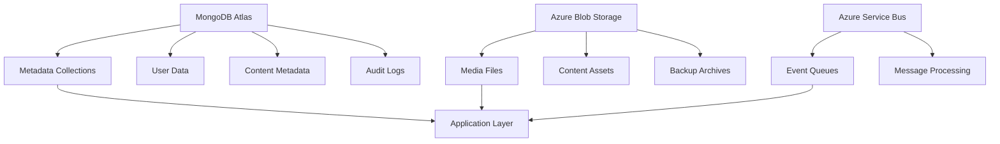
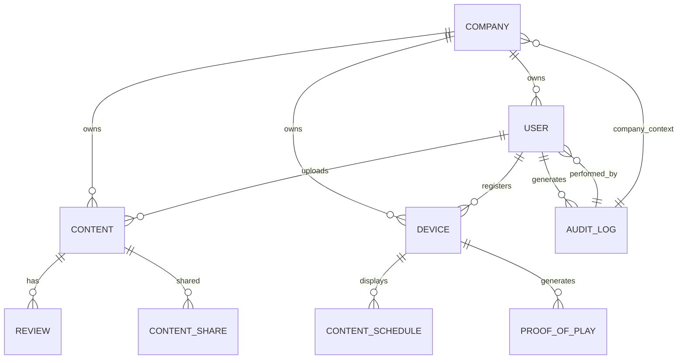
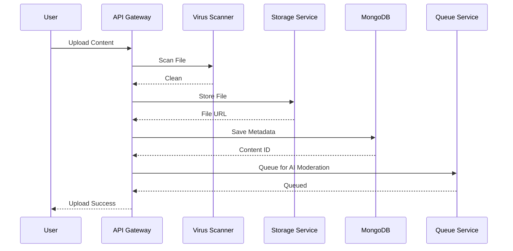
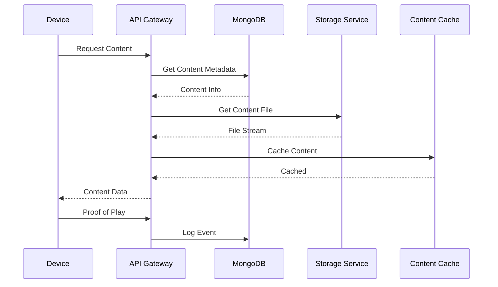

# Adara Digital Signage Platform - Data Model Documentation

**Version:** 2.0.0
**Last Updated:** September 16, 2025
**Database:** MongoDB with Azure Blob Storage integration

## 📋 Overview

This document provides a comprehensive overview of the Adara Digital Signage Platform's data model, including entity schemas, relationships, data flows, and storage architecture. The platform uses a document-based MongoDB architecture optimized for multi-tenant digital signage operations.

## 🏗️ Core Architecture

### Database Design Principles
- **Document-Oriented**: MongoDB collections with embedded documents for related data
- **Multi-Tenant**: Company-based data isolation with secure sharing mechanisms
- **Scalable**: Horizontal scaling support with sharding capabilities
- **Auditable**: Comprehensive audit trails for all data operations
- **Versioned**: Content versioning and soft delete capabilities

### Storage Architecture


## 📊 Entity Schemas

### 1. Company Entity

**Collection:** `companies`
**Purpose:** Multi-tenant company management with HOST/ADVERTISER types

```javascript
{
  "_id": ObjectId("507f1f77bcf86cd799439011"),
  "name": "TechCorp Solutions",
  "type": "HOST", // HOST | ADVERTISER
  "org_code": "ORG-ABC123",
  "address": {
    "street": "123 Business Ave",
    "city": "Dubai",
    "country": "UAE",
    "postal_code": "12345"
  },
  "contact": {
    "phone": "+971-50-123-4567",
    "email": "admin@techcorp.com",
    "website": "https://techcorp.com"
  },
  "settings": {
    "max_users": 50,
    "max_devices": 100,
    "max_content": 1000,
    "allow_sharing": true,
    "branding": {
      "logo_url": "https://storage.azure.com/logos/techcorp.png",
      "primary_color": "#1a73e8",
      "secondary_color": "#34a853"
    }
  },
  "limits": {
    "storage_gb": 100,
    "bandwidth_gb": 500,
    "api_calls_per_hour": 10000
  },
  "status": "ACTIVE", // ACTIVE | SUSPENDED | DELETED
  "created_at": ISODate("2025-01-15T10:30:00Z"),
  "updated_at": ISODate("2025-09-16T14:20:00Z"),
  "created_by": ObjectId("507f1f77bcf86cd799439012"),
  "subscription": {
    "plan": "ENTERPRISE",
    "expires_at": ISODate("2026-01-15T00:00:00Z"),
    "features": ["ai_moderation", "advanced_analytics", "priority_support"]
  }
}
```

### 2. User Entity

**Collection:** `users`
**Purpose:** Multi-type user management with role-based access

```javascript
{
  "_id": ObjectId("507f1f77bcf86cd799439012"),
  "email": "admin@techcorp.com",
  "username": "admin_techcorp",
  "password_hash": "$2b$12$LQv3c1yqBWVHxkd0LHAkCOYz6TtxMQJqhN8/LewdBPj6fMxzBq",
  "user_type": "COMPANY_USER", // SUPER_USER | COMPANY_USER | DEVICE_USER
  "company_id": ObjectId("507f1f77bcf86cd799439011"),
  "profile": {
    "first_name": "John",
    "last_name": "Smith",
    "phone": "+971-50-123-4567",
    "avatar_url": "https://storage.azure.com/avatars/john_smith.jpg",
    "timezone": "Asia/Dubai",
    "language": "en"
  },
  "company_role": "ADMIN", // ADMIN | REVIEWER | EDITOR | VIEWER
  "permissions": [
    "content_create",
    "content_edit",
    "content_approve",
    "user_manage",
    "device_manage",
    "analytics_view"
  ],
  "status": "ACTIVE", // ACTIVE | INACTIVE | SUSPENDED | DELETED
  "last_login": ISODate("2025-09-16T14:15:00Z"),
  "login_attempts": 0,
  "password_reset_token": null,
  "password_reset_expires": null,
  "created_at": ISODate("2025-01-15T10:30:00Z"),
  "updated_at": ISODate("2025-09-16T14:20:00Z"),
  "created_by": ObjectId("507f1f77bcf86cd799439013"),
  "mfa_enabled": false,
  "mfa_secret": null
}
```

### 3. Content Entity

**Collection:** `content`
**Purpose:** Comprehensive content metadata and lifecycle management

```javascript
{
  "_id": ObjectId("507f1f77bcf86cd799439014"),
  "title": "Summer Sale Banner",
  "description": "Promotional banner for summer sale campaign",
  "owner_id": ObjectId("507f1f77bcf86cd799439011"), // Company ID
  "uploaded_by": ObjectId("507f1f77bcf86cd799439012"), // User ID
  "file_info": {
    "original_filename": "summer_sale_banner.jpg",
    "filename": "content_507f1f77bcf86cd799439014.jpg",
    "mime_type": "image/jpeg",
    "size_bytes": 2457600,
    "dimensions": {
      "width": 1920,
      "height": 1080
    },
    "duration_seconds": null, // For videos
    "file_hash": "a1b2c3d4e5f6...",
    "storage_path": "content/2025/09/507f1f77bcf86cd799439014.jpg"
  },
  "metadata": {
    "categories": ["promotional", "seasonal", "banner"],
    "tags": ["summer", "sale", "discount", "banner"],
    "target_audience": "all_customers",
    "priority": "HIGH", // LOW | MEDIUM | HIGH | URGENT
    "schedule": {
      "start_date": ISODate("2025-06-01T00:00:00Z"),
      "end_date": ISODate("2025-08-31T23:59:59Z"),
      "timezone": "Asia/Dubai"
    },
    "geographic_targeting": {
      "countries": ["AE", "SA"],
      "cities": ["Dubai", "Abu Dhabi"]
    }
  },
  "moderation": {
    "status": "APPROVED", // PENDING | APPROVED | REJECTED | FLAGGED
    "ai_analysis": {
      "provider": "gemini",
      "confidence_score": 0.95,
      "categories": ["safe", "promotional"],
      "flags": [],
      "analyzed_at": ISODate("2025-05-15T10:30:00Z")
    },
    "human_review": {
      "reviewer_id": ObjectId("507f1f77bcf86cd799439015"),
      "decision": "APPROVED",
      "notes": "High-quality promotional content",
      "reviewed_at": ISODate("2025-05-15T11:00:00Z")
    }
  },
  "visibility": {
    "level": "PRIVATE", // PRIVATE | SHARED | PUBLIC
    "shared_with": [
      {
        "company_id": ObjectId("507f1f77bcf86cd799439016"),
        "permissions": ["view", "download"],
        "expires_at": ISODate("2025-12-31T23:59:59Z")
      }
    ]
  },
  "versioning": {
    "version": 1,
    "parent_id": null,
    "changes": "Initial upload",
    "previous_versions": []
  },
  "statistics": {
    "views": 1250,
    "displays": 890,
    "engagement_rate": 0.712,
    "last_displayed": ISODate("2025-09-16T12:00:00Z")
  },
  "status": "ACTIVE", // ACTIVE | ARCHIVED | DELETED
  "is_deleted": false,
  "deleted_at": null,
  "deleted_by": null,
  "created_at": ISODate("2025-05-15T10:00:00Z"),
  "updated_at": ISODate("2025-09-16T14:20:00Z")
}
```

### 4. Device Entity

**Collection:** `devices`
**Purpose:** Device registration, authentication, and management

```javascript
{
  "_id": ObjectId("507f1f77bcf86cd799439017"),
  "name": "Lobby Display - Floor 1",
  "device_id": "DEV-ABC123-XYZ789",
  "company_id": ObjectId("507f1f77bcf86cd799439011"),
  "registration_key": "REG-DEF456-GHI789",
  "api_key": "API-JKL012-MNO345",
  "hardware_info": {
    "model": "Samsung UR59C",
    "serial_number": "SN123456789",
    "mac_address": "00:11:22:33:44:55",
    "ip_address": "192.168.1.100",
    "resolution": "3840x2160",
    "orientation": "LANDSCAPE",
    "screen_size_inches": 55,
    "touch_enabled": false
  },
  "location": {
    "building": "Main Office",
    "floor": "1st Floor",
    "room": "Lobby",
    "coordinates": {
      "latitude": 25.1972,
      "longitude": 55.2744
    }
  },
  "configuration": {
    "auto_start": true,
    "brightness_schedule": {
      "day": 70,
      "night": 30,
      "transition_time": "06:00"
    },
    "content_rotation": {
      "interval_seconds": 30,
      "shuffle": true,
      "priority_weighting": true
    },
    "network_settings": {
      "wifi_ssid": "OfficeWiFi",
      "proxy_enabled": false,
      "update_interval_minutes": 5
    }
  },
  "status": {
    "connection": "ONLINE", // ONLINE | OFFLINE | MAINTENANCE
    "health": "HEALTHY", // HEALTHY | WARNING | CRITICAL
    "last_heartbeat": ISODate("2025-09-16T14:25:00Z"),
    "uptime_hours": 168,
    "software_version": "2.1.0",
    "storage_used_gb": 15.5,
    "storage_total_gb": 32.0
  },
  "content_schedule": {
    "assigned_playlists": [
      ObjectId("507f1f77bcf86cd799439018"),
      ObjectId("507f1f77bcf86cd799439019")
    ],
    "current_content": ObjectId("507f1f77bcf86cd799439014"),
    "next_content": ObjectId("507f1f77bcf86cd799439020"),
    "last_sync": ISODate("2025-09-16T14:20:00Z")
  },
  "digital_twin": {
    "virtual_state": "ACTIVE",
    "test_mode": false,
    "remote_control_enabled": true,
    "telemetry_enabled": true
  },
  "created_at": ISODate("2025-03-01T09:00:00Z"),
  "updated_at": ISODate("2025-09-16T14:25:00Z"),
  "registered_by": ObjectId("507f1f77bcf86cd799439012"),
  "last_maintenance": ISODate("2025-08-15T10:00:00Z")
}
```

### 5. Audit Log Entity

**Collection:** `audit_logs`
**Purpose:** Comprehensive audit trail for compliance and security

```javascript
{
  "_id": ObjectId("507f1f77bcf86cd799439021"),
  "timestamp": ISODate("2025-09-16T14:20:00Z"),
  "user_id": ObjectId("507f1f77bcf86cd799439012"),
  "company_id": ObjectId("507f1f77bcf86cd799439011"),
  "action": "CONTENT_UPLOAD",
  "resource_type": "content",
  "resource_id": ObjectId("507f1f77bcf86cd799439014"),
  "details": {
    "filename": "summer_sale_banner.jpg",
    "size_bytes": 2457600,
    "ip_address": "192.168.1.100",
    "user_agent": "Mozilla/5.0...",
    "changes": {
      "before": null,
      "after": {
        "title": "Summer Sale Banner",
        "status": "PENDING"
      }
    }
  },
  "result": "SUCCESS",
  "error_message": null,
  "session_id": "sess_abc123def456",
  "api_endpoint": "/api/content/upload",
  "method": "POST",
  "duration_ms": 1250,
  "location": {
    "ip": "192.168.1.100",
    "country": "AE",
    "city": "Dubai"
  }
}
```

## 🔗 Entity Relationships

### Core Relationships Diagram



### Detailed Relationships

#### 1:N Relationships
- **Company → Users**: One company can have multiple users
- **Company → Devices**: One company can have multiple devices
- **Company → Content**: One company can own multiple content items
- **User → Content**: One user can upload multiple content items
- **User → Audit Logs**: One user generates multiple audit entries
- **Content → Reviews**: One content can have multiple review cycles
- **Device → Proof of Play**: One device generates multiple play events

#### N:M Relationships
- **Content ↔ Companies**: Content can be shared between companies
- **Content ↔ Devices**: Content can be scheduled on multiple devices
- **Users ↔ Roles**: Users can have multiple roles (via user_roles collection)

#### Hierarchical Relationships
- **Super User → All Companies**: Platform administrators oversee all companies
- **Host Company → Advertiser Company**: Host companies can share content with advertisers
- **Content Owner → Content Sharer**: Original owners control sharing permissions

## 📈 Data Flow Architecture

### Content Upload Flow



### Content Display Flow



## 🗄️ Storage Architecture

### MongoDB Collections

| Collection | Purpose | Indexes | Shard Key |
|------------|---------|---------|-----------|
| `companies` | Company management | `org_code`, `type`, `status` | `type` |
| `users` | User accounts | `email`, `company_id`, `user_type` | `company_id` |
| `content` | Content metadata | `owner_id`, `status`, `moderation.status` | `owner_id` |
| `devices` | Device management | `company_id`, `device_id`, `status.connection` | `company_id` |
| `audit_logs` | Audit trail | `timestamp`, `user_id`, `company_id`, `action` | `company_id` |
| `reviews` | Content reviews | `content_id`, `reviewer_id`, `status` | `content_id` |
| `content_shares` | Content sharing | `content_id`, `from_company_id`, `to_company_id` | `from_company_id` |
| `proof_of_play` | Analytics events | `device_id`, `content_id`, `timestamp` | `device_id` |

### Azure Blob Storage Structure

```
📁 adara-signage-storage/
├── 📁 content/
│   ├── 📁 2025/
│   │   ├── 📁 09/
│   │   │   ├── content_507f1f77bcf86cd799439014.jpg
│   │   │   └── content_507f1f77bcf86cd799439015.mp4
│   │   └── 📁 10/
│   └── 📁 archives/
├── 📁 avatars/
│   ├── user_507f1f77bcf86cd799439012.jpg
│   └── company_507f1f77bcf86cd799439011.png
├── 📁 logs/
│   ├── 📁 2025-09-16/
│   └── 📁 2025-09-15/
└── 📁 backups/
    ├── 📁 daily/
    └── 📁 weekly/
```

### Azure Service Bus Topics

| Topic | Purpose | Subscriptions |
|-------|---------|---------------|
| `content-events` | Content lifecycle events | `moderation-queue`, `analytics-queue` |
| `device-events` | Device status updates | `monitoring-queue`, `alert-queue` |
| `user-events` | User activity events | `audit-queue`, `notification-queue` |
| `system-events` | Platform system events | `maintenance-queue`, `backup-queue` |

## 🔒 Data Security & Privacy

### Encryption Strategy
- **Data at Rest**: AES-256 encryption for sensitive fields
- **Data in Transit**: TLS 1.3 for all communications
- **File Storage**: Server-side encryption in Azure Blob Storage
- **Database**: MongoDB field-level encryption for PII

### Data Isolation
- **Company-based**: Complete data segregation by company
- **Row-level Security**: Database views with company filtering
- **API Scoping**: Company context in all API operations
- **Audit Boundaries**: Company-scoped audit log access

### Privacy Compliance
- **GDPR**: Data subject rights, consent management, data portability
- **Data Retention**: Configurable retention policies by data type
- **Anonymization**: PII removal for analytics and logs
- **Consent Tracking**: User consent for data processing

## 📊 Performance Optimization

### Indexing Strategy

```javascript
// Compound indexes for common queries
db.content.createIndex({
  "owner_id": 1,
  "status": 1,
  "moderation.status": 1,
  "created_at": -1
});

// Text indexes for search
db.content.createIndex({
  "title": "text",
  "description": "text",
  "metadata.tags": "text"
});

// Geospatial indexes for location-based queries
db.devices.createIndex({
  "location.coordinates": "2dsphere"
});
```

### Caching Strategy
- **Redis**: Session data, frequently accessed metadata
- **CDN**: Static content delivery with Azure CDN
- **Application Cache**: Content metadata with TTL
- **Device Cache**: Offline content with sync mechanisms

### Query Optimization
- **Covered Queries**: Indexes covering query fields
- **Aggregation Pipeline**: Efficient data processing
- **Pagination**: Cursor-based pagination for large datasets
- **Projection**: Field selection to reduce data transfer

## 🔄 Data Migration & Versioning

### Schema Evolution
- **Backward Compatibility**: Support for multiple schema versions
- **Migration Scripts**: Automated schema updates
- **Data Transformation**: Safe data migration with rollback
- **Version Tracking**: Schema version metadata

### Content Versioning
```javascript
{
  "content_id": ObjectId("507f1f77bcf86cd799439014"),
  "versions": [
    {
      "version": 1,
      "file_hash": "a1b2c3d4...",
      "changes": "Initial upload",
      "created_at": ISODate("2025-05-15T10:00:00Z")
    },
    {
      "version": 2,
      "file_hash": "b2c3d4e5...",
      "changes": "Updated branding",
      "created_at": ISODate("2025-06-01T14:30:00Z")
    }
  ]
}
```

## 📈 Analytics & Reporting

### Data Aggregation Pipeline

```javascript
// Daily content performance aggregation
db.content.aggregate([
  {
    $match: {
      "created_at": {
        $gte: ISODate("2025-09-16T00:00:00Z"),
        $lt: ISODate("2025-09-17T00:00:00Z")
      }
    }
  },
  {
    $group: {
      _id: "$owner_id",
      total_content: { $sum: 1 },
      approved_content: {
        $sum: { $cond: [{ $eq: ["$moderation.status", "APPROVED"] }, 1, 0] }
      },
      total_views: { $sum: "$statistics.views" },
      avg_engagement: { $avg: "$statistics.engagement_rate" }
    }
  }
]);
```

### Real-time Analytics
- **Event Streaming**: Real-time event processing with Azure Service Bus
- **Time-series Data**: Device metrics and performance data
- **Geographic Analytics**: Location-based usage patterns
- **Predictive Analytics**: ML-based usage forecasting

## 🛠️ Implementation Details

## 🛠️ Implementation Details

### Pydantic Models (Python Backend)

```python
from pydantic import BaseModel, Field, validator
from typing import Optional, List, Dict, Any
from datetime import datetime
from bson import ObjectId
from enum import Enum

class UserType(str, Enum):
    SUPER_USER = "SUPER_USER"
    COMPANY_USER = "COMPANY_USER"
    DEVICE_USER = "DEVICE_USER"

class CompanyType(str, Enum):
    HOST = "HOST"
    ADVERTISER = "ADVERTISER"

class UserRole(str, Enum):
    ADMIN = "ADMIN"
    REVIEWER = "REVIEWER"
    EDITOR = "EDITOR"
    VIEWER = "VIEWER"

class ContentStatus(str, Enum):
    ACTIVE = "ACTIVE"
    PENDING = "PENDING"
    APPROVED = "APPROVED"
    REJECTED = "REJECTED"
    ARCHIVED = "ARCHIVED"
    DELETED = "DELETED"

# Company Models
class CompanyBase(BaseModel):
    name: str
    type: CompanyType
    org_code: str
    status: str = "ACTIVE"

class CompanyCreate(CompanyBase):
    address: Dict[str, Any]
    contact: Dict[str, Any]
    settings: Optional[Dict[str, Any]] = {}

class CompanyUpdate(BaseModel):
    name: Optional[str] = None
    address: Optional[Dict[str, Any]] = None
    contact: Optional[Dict[str, Any]] = None
    settings: Optional[Dict[str, Any]] = None
    status: Optional[str] = None

class Company(CompanyBase):
    id: str = Field(alias="_id")
    address: Dict[str, Any]
    contact: Dict[str, Any]
    settings: Dict[str, Any]
    limits: Dict[str, Any]
    created_at: datetime
    updated_at: datetime
    created_by: Optional[str] = None

    class Config:
        allow_population_by_field_name = True
        json_encoders = {ObjectId: str}

# User Models
class UserBase(BaseModel):
    email: str
    user_type: UserType

class UserCreate(UserBase):
    password: str
    profile: Dict[str, Any]
    company_id: Optional[str] = None
    company_role: Optional[UserRole] = None

class UserUpdate(BaseModel):
    profile: Optional[Dict[str, Any]] = None
    company_role: Optional[UserRole] = None
    status: Optional[str] = None
    password: Optional[str] = None

class User(UserBase):
    id: str = Field(alias="_id")
    username: Optional[str] = None
    profile: Dict[str, Any]
    company_id: Optional[str] = None
    company_role: Optional[UserRole] = None
    permissions: List[str] = []
    status: str = "ACTIVE"
    last_login: Optional[datetime] = None
    login_attempts: int = 0
    created_at: datetime
    updated_at: datetime
    created_by: Optional[str] = None

    class Config:
        allow_population_by_field_name = True
        json_encoders = {ObjectId: str}

# Content Models
class ContentBase(BaseModel):
    title: str
    description: Optional[str] = None

class ContentCreate(ContentBase):
    categories: List[str] = []
    tags: List[str] = []
    target_audience: Optional[str] = None
    priority: str = "MEDIUM"
    schedule: Optional[Dict[str, Any]] = None
    geographic_targeting: Optional[Dict[str, Any]] = None

class ContentUpdate(BaseModel):
    title: Optional[str] = None
    description: Optional[str] = None
    categories: Optional[List[str]] = None
    tags: Optional[List[str]] = None
    target_audience: Optional[str] = None
    priority: Optional[str] = None
    schedule: Optional[Dict[str, Any]] = None
    geographic_targeting: Optional[Dict[str, Any]] = None
    status: Optional[ContentStatus] = None

class Content(ContentBase):
    id: str = Field(alias="_id")
    owner_id: str
    uploaded_by: str
    file_info: Dict[str, Any]
    metadata: Dict[str, Any]
    moderation: Dict[str, Any]
    visibility: Dict[str, Any]
    version: int = 1
    statistics: Dict[str, Any]
    status: ContentStatus = ContentStatus.ACTIVE
    created_at: datetime
    updated_at: datetime

    class Config:
        allow_population_by_field_name = True
        json_encoders = {ObjectId: str}

# Device Models
class DeviceBase(BaseModel):
    name: str
    device_id: str

class DeviceCreate(DeviceBase):
    registration_key: str
    hardware_info: Dict[str, Any]
    location: Optional[Dict[str, Any]] = None
    configuration: Optional[Dict[str, Any]] = None

class DeviceUpdate(BaseModel):
    name: Optional[str] = None
    location: Optional[Dict[str, Any]] = None
    configuration: Optional[Dict[str, Any]] = None
    status: Optional[Dict[str, Any]] = None

class Device(DeviceBase):
    id: str = Field(alias="_id")
    company_id: str
    registration_key: str
    api_key: str
    hardware_info: Dict[str, Any]
    location: Optional[Dict[str, Any]] = None
    configuration: Dict[str, Any]
    status: Dict[str, Any]
    content_schedule: Dict[str, Any]
    digital_twin: Dict[str, Any]
    created_at: datetime
    updated_at: datetime
    registered_by: str
    last_maintenance: Optional[datetime] = None

    class Config:
        allow_population_by_field_name = True
        json_encoders = {ObjectId: str}

# Audit Log Models
class AuditLogBase(BaseModel):
    user_id: str
    action: str
    resource_type: str
    resource_id: str

class AuditLogCreate(AuditLogBase):
    details: Optional[Dict[str, Any]] = None
    result: str = "SUCCESS"
    error_message: Optional[str] = None
    severity: str = "INFO"

class AuditLog(AuditLogBase):
    id: str = Field(alias="_id")
    company_id: Optional[str] = None
    details: Optional[Dict[str, Any]] = None
    result: str
    error_message: Optional[str] = None
    severity: str
    session_id: Optional[str] = None
    api_endpoint: Optional[str] = None
    method: Optional[str] = None
    duration_ms: Optional[float] = None
    location: Optional[Dict[str, Any]] = None
    timestamp: datetime

    class Config:
        allow_population_by_field_name = True
        json_encoders = {ObjectId: str}
```

### Repository Pattern Implementation

```python
from abc import ABC, abstractmethod
from typing import List, Optional, Dict, Any
from motor.motor_asyncio import AsyncIOMotorCollection
from bson import ObjectId
from datetime import datetime

class BaseRepository(ABC):
    def __init__(self, collection: AsyncIOMotorCollection):
        self.collection = collection

    @abstractmethod
    async def create(self, data: Dict[str, Any]) -> str:
        pass

    @abstractmethod
    async def get_by_id(self, id: str) -> Optional[Dict[str, Any]]:
        pass

    @abstractmethod
    async def update(self, id: str, data: Dict[str, Any]) -> bool:
        pass

    @abstractmethod
    async def delete(self, id: str) -> bool:
        pass

class CompanyRepository(BaseRepository):
    async def create(self, company_data: Dict[str, Any]) -> str:
        company_data.update({
            "created_at": datetime.utcnow(),
            "updated_at": datetime.utcnow()
        })
        result = await self.collection.insert_one(company_data)
        return str(result.inserted_id)

    async def get_by_id(self, company_id: str) -> Optional[Dict[str, Any]]:
        return await self.collection.find_one({"_id": ObjectId(company_id)})

    async def get_by_org_code(self, org_code: str) -> Optional[Dict[str, Any]]:
        return await self.collection.find_one({"org_code": org_code})

    async def update(self, company_id: str, update_data: Dict[str, Any]) -> bool:
        update_data["updated_at"] = datetime.utcnow()
        result = await self.collection.update_one(
            {"_id": ObjectId(company_id)},
            {"$set": update_data}
        )
        return result.modified_count > 0

    async def delete(self, company_id: str) -> bool:
        result = await self.collection.update_one(
            {"_id": ObjectId(company_id)},
            {"$set": {"status": "DELETED", "updated_at": datetime.utcnow()}}
        )
        return result.modified_count > 0

    async def get_companies_by_type(self, company_type: str) -> List[Dict[str, Any]]:
        cursor = self.collection.find({"type": company_type, "status": "ACTIVE"})
        return await cursor.to_list(None)

class UserRepository(BaseRepository):
    async def create(self, user_data: Dict[str, Any]) -> str:
        user_data.update({
            "created_at": datetime.utcnow(),
            "updated_at": datetime.utcnow()
        })
        result = await self.collection.insert_one(user_data)
        return str(result.inserted_id)

    async def get_by_id(self, user_id: str) -> Optional[Dict[str, Any]]:
        return await self.collection.find_one({"_id": ObjectId(user_id)})

    async def get_by_email(self, email: str) -> Optional[Dict[str, Any]]:
        return await self.collection.find_one({"email": email})

    async def get_users_by_company(self, company_id: str) -> List[Dict[str, Any]]:
        cursor = self.collection.find({"company_id": company_id, "status": "ACTIVE"})
        return await cursor.to_list(None)

    async def update(self, user_id: str, update_data: Dict[str, Any]) -> bool:
        update_data["updated_at"] = datetime.utcnow()
        result = await self.collection.update_one(
            {"_id": ObjectId(user_id)},
            {"$set": update_data}
        )
        return result.modified_count > 0

    async def update_last_login(self, user_id: str) -> bool:
        result = await self.collection.update_one(
            {"_id": ObjectId(user_id)},
            {"$set": {"last_login": datetime.utcnow()}}
        )
        return result.modified_count > 0

class ContentRepository(BaseRepository):
    async def create(self, content_data: Dict[str, Any]) -> str:
        content_data.update({
            "created_at": datetime.utcnow(),
            "updated_at": datetime.utcnow()
        })
        result = await self.collection.insert_one(content_data)
        return str(result.inserted_id)

    async def get_by_id(self, content_id: str) -> Optional[Dict[str, Any]]:
        return await self.collection.find_one({"_id": ObjectId(content_id)})

    async def get_content_by_owner(self, owner_id: str, status: str = "ACTIVE") -> List[Dict[str, Any]]:
        cursor = self.collection.find({"owner_id": owner_id, "status": status})
        return await cursor.to_list(None)

    async def get_content_by_moderation_status(self, status: str) -> List[Dict[str, Any]]:
        cursor = self.collection.find({"moderation.status": status})
        return await cursor.to_list(None)

    async def update(self, content_id: str, update_data: Dict[str, Any]) -> bool:
        update_data["updated_at"] = datetime.utcnow()
        result = await self.collection.update_one(
            {"_id": ObjectId(content_id)},
            {"$set": update_data}
        )
        return result.modified_count > 0

    async def search_content(self, query: str, owner_id: Optional[str] = None) -> List[Dict[str, Any]]:
        search_query = {
            "$text": {"$search": query},
            "status": "ACTIVE"
        }
        if owner_id:
            search_query["owner_id"] = owner_id

        cursor = self.collection.find(search_query)
        return await cursor.to_list(None)
```

### API Integration Examples

```python
from fastapi import APIRouter, Depends, HTTPException
from typing import List, Optional
from motor.motor_asyncio import AsyncIOMotorDatabase

router = APIRouter()

# Dependency injection for database
async def get_database() -> AsyncIOMotorDatabase:
    # Database connection logic here
    pass

@router.post("/companies", response_model=Company)
async def create_company(
    company: CompanyCreate,
    db: AsyncIOMotorDatabase = Depends(get_database)
):
    """Create a new company"""
    repo = CompanyRepository(db.companies)

    # Check if org_code already exists
    existing = await repo.get_by_org_code(company.org_code)
    if existing:
        raise HTTPException(status_code=400, detail="Organization code already exists")

    company_data = company.dict()
    company_id = await repo.create(company_data)

    created_company = await repo.get_by_id(company_id)
    return Company(**created_company)

@router.get("/companies/{company_id}", response_model=Company)
async def get_company(
    company_id: str,
    db: AsyncIOMotorDatabase = Depends(get_database)
):
    """Get company by ID"""
    repo = CompanyRepository(db.companies)
    company = await repo.get_by_id(company_id)

    if not company:
        raise HTTPException(status_code=404, detail="Company not found")

    return Company(**company)

@router.get("/companies", response_model=List[Company])
async def list_companies(
    company_type: Optional[CompanyType] = None,
    db: AsyncIOMotorDatabase = Depends(get_database)
):
    """List companies with optional filtering"""
    repo = CompanyRepository(db.companies)

    if company_type:
        companies = await repo.get_companies_by_type(company_type.value)
    else:
        cursor = repo.collection.find({"status": "ACTIVE"})
        companies = await cursor.to_list(None)

    return [Company(**company) for company in companies]

@router.put("/companies/{company_id}", response_model=Company)
async def update_company(
    company_id: str,
    company_update: CompanyUpdate,
    db: AsyncIOMotorDatabase = Depends(get_database)
):
    """Update company information"""
    repo = CompanyRepository(db.companies)

    # Check if company exists
    existing = await repo.get_by_id(company_id)
    if not existing:
        raise HTTPException(status_code=404, detail="Company not found")

    update_data = company_update.dict(exclude_unset=True)
    success = await repo.update(company_id, update_data)

    if not success:
        raise HTTPException(status_code=500, detail="Failed to update company")

    updated_company = await repo.get_by_id(company_id)
    return Company(**updated_company)
```

### Database Migration Scripts

```python
# migration_001_initial_schema.py
from motor.motor_asyncio import AsyncIOMotorDatabase
from datetime import datetime

async def migrate_initial_schema(db: AsyncIOMotorDatabase):
    """Initial database schema migration"""

    # Create indexes for companies collection
    await db.companies.create_index("org_code", unique=True)
    await db.companies.create_index("type")
    await db.companies.create_index("status")
    await db.companies.create_index("created_at")

    # Create indexes for users collection
    await db.users.create_index("email", unique=True)
    await db.users.create_index("company_id")
    await db.users.create_index("user_type")
    await db.users.create_index("status")
    await db.users.create_index("last_login")

    # Create indexes for content collection
    await db.content.create_index("owner_id")
    await db.content.create_index("uploaded_by")
    await db.content.create_index("status")
    await db.content.create_index("moderation.status")
    await db.content.create_index("created_at")
    await db.content.create_index("updated_at")

    # Text index for content search
    await db.content.create_index({
        "title": "text",
        "description": "text",
        "metadata.tags": "text",
        "metadata.categories": "text"
    })

    # Create indexes for devices collection
    await db.devices.create_index("company_id")
    await db.devices.create_index("device_id", unique=True)
    await db.devices.create_index("status.connection")
    await db.devices.create_index("created_at")

    # Create indexes for audit_logs collection
    await db.audit_logs.create_index("user_id")
    await db.audit_logs.create_index("company_id")
    await db.audit_logs.create_index("action")
    await db.audit_logs.create_index("resource_type")
    await db.audit_logs.create_index("timestamp")
    await db.audit_logs.create_index("severity")

    # Compound indexes for common queries
    await db.audit_logs.create_index([
        ("company_id", 1),
        ("timestamp", -1)
    ])

    await db.content.create_index([
        ("owner_id", 1),
        ("status", 1),
        ("created_at", -1)
    ])

# migration_002_add_versioning.py
async def migrate_add_versioning(db: AsyncIOMotorDatabase):
    """Add content versioning support"""

    # Add versioning fields to existing content
    await db.content.update_many(
        {"version": {"$exists": False}},
        {"$set": {
            "version": 1,
            "versioning": {
                "version": 1,
                "parent_id": None,
                "changes": "Initial version",
                "created_at": datetime.utcnow()
            }
        }}
    )

    # Create content_versions collection
    await db.create_collection("content_versions")

    # Add indexes for content_versions
    await db.content_versions.create_index("content_id")
    await db.content_versions.create_index("version")
    await db.content_versions.create_index("created_at")
```

### Data Validation & Constraints

```python
from pydantic import validator, ValidationError
from typing import List
import re

class CompanyCreate(CompanyBase):
    @validator('org_code')
    def validate_org_code(cls, v):
        if not re.match(r'^ORG-[A-Z0-9]{6}$', v):
            raise ValueError('Organization code must be in format ORG-XXXXXX')
        return v

    @validator('name')
    def validate_name(cls, v):
        if len(v.strip()) < 2:
            raise ValueError('Company name must be at least 2 characters')
        return v.strip()

class UserCreate(UserBase):
    @validator('email')
    def validate_email(cls, v):
        if not re.match(r'^[a-zA-Z0-9._%+-]+@[a-zA-Z0-9.-]+\.[a-zA-Z]{2,}$', v):
            raise ValueError('Invalid email format')
        return v.lower()

    @validator('password')
    def validate_password(cls, v):
        if len(v) < 8:
            raise ValueError('Password must be at least 8 characters')
        if not re.search(r'[A-Z]', v):
            raise ValueError('Password must contain at least one uppercase letter')
        if not re.search(r'[a-z]', v):
            raise ValueError('Password must contain at least one lowercase letter')
        if not re.search(r'\d', v):
            raise ValueError('Password must contain at least one digit')
        return v

class ContentCreate(ContentBase):
    @validator('title')
    def validate_title(cls, v):
        if len(v.strip()) < 1:
            raise ValueError('Title cannot be empty')
        if len(v) > 200:
            raise ValueError('Title cannot exceed 200 characters')
        return v.strip()

    @validator('categories')
    def validate_categories(cls, v):
        if len(v) > 10:
            raise ValueError('Cannot have more than 10 categories')
        return [cat.lower().strip() for cat in v]

    @validator('tags')
    def validate_tags(cls, v):
        if len(v) > 20:
            raise ValueError('Cannot have more than 20 tags')
        return [tag.lower().strip() for tag in v]
```

This enhanced data model provides a comprehensive foundation for the Adara Digital Signage Platform with robust validation, efficient querying, and scalable architecture.## 📚 Related Documentation

- **[ARCHITECTURE.md](ARCHITECTURE.md)** - System architecture overview
- **[ENHANCED_RBAC_SYSTEM.md](ENHANCED_RBAC_SYSTEM.md)** - Access control and permissions
- **[api.md](api.md)** - API endpoints and data contracts
- **[DATA_MODEL.md](DATA_MODEL.md)** - This document
- **[DEPLOYMENT_GUIDE.md](DEPLOYMENT_GUIDE.md)** - Infrastructure and deployment

---

**Document Version:** 2.0.0
**Last Updated:** September 16, 2025
**Review Cycle:** Monthly
**Owner:** Data Architecture Team