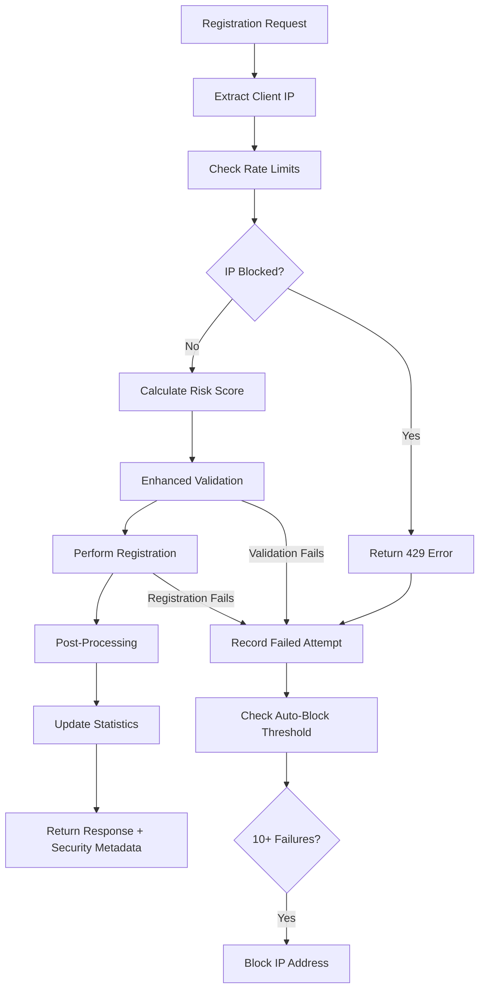

# Enhanced vs Normal Device Registration - Comprehensive Analysis

## Overview

This document provides a detailed comparison between the **Normal Device Registration** system and the **Enhanced Device Registration** system in the Adarah Digital Signage platform.

## Key Differences Summary

| Feature | Normal Registration | Enhanced Registration |
|---------|-------------------|---------------------|
| **Rate Limiting** | None | 5 attempts/hour, 20/day per IP |
| **IP Blocking** | None | Automatic blocking after 10 failures |
| **Risk Scoring** | None | Comprehensive risk assessment (0-10) |
| **Device Fingerprinting** | None | Hardware ID, MAC addresses, capabilities |
| **Security Monitoring** | Basic logging | Real-time statistics & threat analysis |
| **Audit Trail** | Minimal | Detailed security attempt logging |
| **Block Management** | None | Automatic & manual IP unblocking |
| **Geographic Analysis** | None | IP-based location risk assessment |
| **Temporal Analysis** | None | Off-hours registration risk scoring |
| **User Agent Validation** | None | Bot detection & suspicious pattern analysis |

## 1. Normal Device Registration (`/api/device/register`)

### Current Implementation
- **Endpoint**: `POST /api/device/register`
- **Purpose**: Basic device registration for legacy compatibility
- **Security Level**: Basic
- **Use Case**: Simple device onboarding

### Features
```
✓ Registration key validation
✓ Device record creation
✓ Authentication credentials generation
✓ Basic database storage
✓ Simple error handling
✓ Minimal audit logging
```

### Limitations
```
✗ No rate limiting protection
✗ No IP-based security
✗ No risk assessment
✗ No device fingerprinting
✗ No suspicious activity detection
✗ No comprehensive monitoring
```

### Typical Flow
1. Validate registration key exists and is unused
2. Create device record in database
3. Generate API key for device authentication
4. Mark registration key as used
5. Return device credentials

## 2. Enhanced Device Registration (`/api/device/register/enhanced`)

### Current Implementation
- **Endpoint**: `POST /api/device/register/enhanced`
- **Purpose**: High-security device registration with comprehensive protection
- **Security Level**: Enterprise-grade
- **Use Case**: Production environments requiring robust security

### Security Features

#### 2.1 Rate Limiting & IP Protection
```python
# Configuration
max_attempts_per_hour = 5
max_attempts_per_day = 20
block_duration_minutes = 30
high_risk_threshold = 7.0

# Protection Levels
- Hourly limit: 5 registration attempts per IP
- Daily limit: 20 registration attempts per IP  
- Auto-block: 10 consecutive failures = 30 min block
- Manual override: Admin can unblock IPs
```

#### 2.2 Risk Scoring System (0-10 scale)
```python
Risk Factors:
+ 0.5 points per previous failure (max 3.0)
+ 1.0 points for off-hours registration (6 PM - 6 AM)
+ 2.0 points for missing device fingerprint
+ 1.5 points for missing user agent
+ 3.0 points for bot/crawler detection
+ 2.0 points for multiple rapid attempts
+ 1.5 points for suspicious device names

Risk Levels:
- Low: 0-2.9 (Normal processing)
- Medium: 3.0-4.9 (Additional logging)
- High: 5.0-6.9 (Flagged for review)
- Critical: 7.0+ (High-risk registration)
```

#### 2.3 Device Fingerprinting
```javascript
// Expected fingerprint data
{
  hardware_id: "unique-hardware-identifier",
  mac_addresses: ["00:11:22:33:44:55"],
  device_capabilities: {
    screen_resolution: "1920x1080",
    os_version: "Android 11",
    app_version: "1.2.3"
  },
  installation_metadata: {
    timezone: "UTC-5",
    locale: "en_US"
  }
}
```

#### 2.4 Enhanced Validation
```python
Validation Checks:
✓ Device name uniqueness (case-insensitive)
✓ Registration key age validation (30 day limit)
✓ Suspicious name pattern detection
✓ Duplicate fingerprint detection
✓ Geographic anomaly detection
✓ User agent authenticity verification
```

#### 2.5 Comprehensive Monitoring
```python
Real-time Statistics:
- Total registration attempts
- Success/failure rates
- Blocked IP addresses count
- Recent attempts (last hour)
- High-risk registrations
- Active monitoring IPs
- Device status breakdown
```

### Enhanced Registration Flow



## 3. Security Monitoring & Management

### 3.1 Security Statistics API
```http
GET /api/device/registration/stats
```
Returns comprehensive registration security metrics:
```json
{
  "total_registration_attempts": 150,
  "successful_registrations": 142,
  "failed_registrations": 8,
  "success_rate": 94.7,
  "blocked_ip_addresses": 2,
  "recent_attempts_last_hour": 5,
  "high_risk_registrations": 3,
  "total_registered_devices": 142
}
```

### 3.2 Security Status API
```http
GET /api/device/security/status
```
Returns current threat level and security posture:
```json
{
  "security_status": {
    "level": "normal",
    "blocked_ip_count": 2,
    "recent_failed_attempts": 8,
    "device_status_breakdown": {
      "active": 142,
      "pending": 0
    },
    "total_monitored_ips": 25,
    "last_updated": "2024-01-15T10:30:00Z"
  }
}
```

### 3.3 IP Management API
```http
POST /api/device/registration/unblock-ip
```
Admin endpoint for manual IP unblocking:
```json
{
  "ip_address": "192.168.1.100"
}
```

## 4. Implementation Status

### ✅ Implemented Features
- Enhanced security module (`enhanced_device_registration.py`)
- Rate limiting and IP blocking system
- Risk scoring algorithm
- Real-time security statistics
- Comprehensive audit logging
- Manual IP unblocking capability
- Security monitoring endpoints

### ✅ Working Endpoints
- `/api/device/register/enhanced` - Full enhanced registration
- `/api/device/registration/stats` - Security statistics
- `/api/device/security/status` - Security status monitoring
- `/api/device/registration/unblock-ip` - Manual IP management

### 🔄 Flutter Integration Status
The Flutter app currently calls the enhanced endpoint but may need debugging:
```dart
// Current Flutter implementation
await ApiService.registerDeviceEnhanced({
  'device_name': deviceName,
  'registration_key': registrationKey,
  'location': location,
  'fingerprint': deviceFingerprint
});
```

## 5. Migration Recommendations

### For New Deployments
- **Use Enhanced Registration**: All new installations should use `/api/device/register/enhanced`
- **Enable Security Monitoring**: Configure security statistics dashboard
- **Set Up Alerts**: Monitor high-risk registrations and IP blocking events

### For Existing Deployments
- **Gradual Migration**: Continue supporting legacy endpoint during transition
- **Security Audit**: Review existing device registrations for anomalies
- **Rate Limiting**: Implement enhanced security for new registrations
- **Monitoring**: Add security statistics to admin dashboard

### For Flutter Application
- **Debug Network Calls**: Verify enhanced endpoint is reachable
- **Implement Fingerprinting**: Add device fingerprint collection
- **Error Handling**: Handle rate limiting and security errors gracefully
- **Retry Logic**: Implement exponential backoff for failed registrations

## 6. Security Benefits

### Enhanced Registration Advantages
1. **Prevents Abuse**: Rate limiting stops automated registration attacks
2. **Detects Threats**: Risk scoring identifies suspicious registrations
3. **Blocks Attackers**: Automatic IP blocking stops persistent threats
4. **Provides Visibility**: Real-time monitoring shows security posture
5. **Enables Response**: Manual controls allow admin intervention
6. **Maintains Audit**: Comprehensive logging for compliance

### Normal Registration Use Cases
1. **Development/Testing**: Simple registration for dev environments
2. **Legacy Compatibility**: Existing integrations requiring basic flow
3. **Low-Risk Environments**: Internal networks with limited exposure
4. **Debugging**: Fallback when enhanced registration has issues

## 7. Troubleshooting Common Issues

### Flutter Registration Not Working
```bash
# Check if enhanced endpoint is available
curl -X POST http://backend:8000/api/device/register/enhanced \
  -H "Content-Type: application/json" \
  -d '{"device_name":"test","registration_key":"test-key"}'

# Verify Flutter API service configuration
# Check network connectivity and endpoint URLs
```

### Rate Limiting Issues
```python
# Check blocked IPs
GET /api/device/security/status

# Unblock specific IP
POST /api/device/registration/unblock-ip
{"ip_address": "192.168.1.100"}
```

### High Risk Scores
```python
# Common causes and solutions:
- Off-hours registration: Normal for some deployments
- Missing fingerprint: Ensure Flutter sends device data
- Bot detection: Check user agent strings
- Multiple attempts: Clear failed attempt history
```

## 8. Future Enhancements

### Planned Features
- Geographic risk assessment using IP geolocation
- Machine learning-based anomaly detection
- Integration with threat intelligence feeds
- Advanced device fingerprinting
- Real-time security alerts and notifications
- Compliance reporting (SOC 2, ISO 27001)

### Configuration Options
- Customizable rate limits per organization
- Risk score thresholds and responses
- Geographic restrictions and allowlists
- Custom blocking rules and patterns

---

## Conclusion

The **Enhanced Device Registration** system provides enterprise-grade security features that significantly improve the platform's resistance to abuse and unauthorized access. While the **Normal Registration** system remains available for compatibility, new deployments should prioritize the enhanced system for optimal security posture.

The comprehensive monitoring, rate limiting, and risk assessment capabilities make enhanced registration suitable for production environments where security is paramount, while still maintaining the simplicity and reliability needed for legitimate device registrations.
